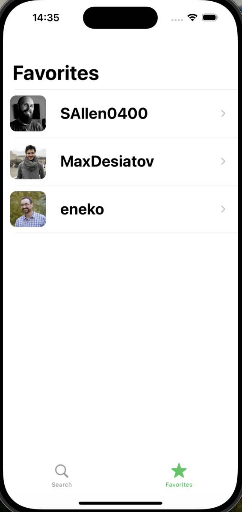

# GitHubFollowers

GitHubFollowers is an iOS app that allows users to search for GitHub users and view their followers. This project is built using Swift and UIKit.

## Table of Contents

- [Features](#features)
- [Screenshots](#screenshots)
- [Requirements](#requirements)
- [Usage](#usage)
- [Possible Improvements](#possible-improvements)

## Features

- Search for GitHub users by username.
- View followers of the searched user.
- Favorite followers for quick access.
- View detailed information about each user, including their bio and location.
- Integrates with the GitHub API for real-time data.

## Screenshots

  
   
  <em>Search Screen</em>

  
   
  <em>Follower List</em>

  
   
  <em>Favorite List</em>

  
   
  <em>User Info Screen</em>

## Requirements

- iOS 12.0+
- Xcode 12.0+
- Swift 5.0+

## Usage

1. Launch the app.
2. Enter a GitHub username in the search field and tap search.
3. View the list of followers for the searched user.
4. Tap on a follower to view their detailed information.
5. Add followers to your favorites for quick access later.
6. Navigate to your favorites list to view all your saved followers.

## Possible Improvements

- Implement better error handling for API calls.
- Enhance UI/UX with animations and design improvements.
- Add a feature to view user repositories.
- Implement pagination for larger follower lists.
- Allow sharing favorite users to social media.
